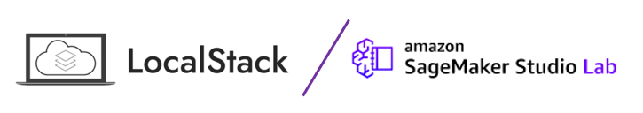

# localstack on Amazon SageMaker Studio Lab

The notebook to run the [localstack](https://github.com/localstack/localstack) on [Amazon SageMaker Studio Lab](https://studiolab.sagemaker.aws/).

**Benefit**

You can get the environment to test AWS API without AWS account and fee and invoke it by 1 click. SageMaker Studio Lab has Terminal and the static storage. If enables you to execute localstack and the environment and artifacts are saved if you close the session.

## Setup

1. Push the Open in Studio Lab button above and clone entire repository.
2. Clone entire repository.
   * If you do not have Studio Lab account, [please requrest it from the form](https://studiolab.sagemaker.aws/requestAccount).
3. Create conda environment from `environment.yml` by `conda env create -f environment.yml`.
4. Create `.env` file refered by `dotenv.txt`.
5. Run `SERVICES=s3,lambda DEBUG=1 localstack start --host` from the Terminal.
   * I could not confirm other services works fine. There is the restrict of service without docker. Please refer [question: Starting localstack without docker installation](https://github.com/localstack/localstack/issues/4748)
6. Confirm `localstack status services` shows available services.
7. Run `aws configure --profile default` and set variable according to [localstack document](https://docs.localstack.cloud/integrations/aws-cli/#setting-up-local-region-and-credentials-to-run-localstack)
7. Enjoy [notebook!](localstack.ipynb)! 

## Tips

* If you can not run as host, you should modify the [`in_docker` function](https://github.com/localstack/localstack/blob/master/localstack/config.py#L206
).
* If you can not see the kernel on launcher or notebook, you should run `ipython kernel install --user --name localstack`

## Reference

* [AWS Command Line Interface](https://docs.localstack.cloud/integrations/aws-cli/#setting-up-local-region-and-credentials-to-run-localstack)
* [Configuration](https://docs.localstack.cloud/localstack/configuration/#core)
* [Starting LocalStack with the LocalStack CLI](https://docs.localstack.cloud/get-started/#starting-localstack-with-the-localstack-cli)
